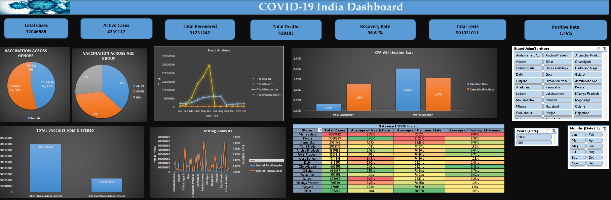

# COVID-19 India Data Analytics Dashboard

## Overview

This project provides an in-depth analysis of India’s COVID-19 situation using Microsoft Excel. It includes trends in confirmed cases, recoveries, deaths, testing, and vaccination progress across states and time periods. The goal is to deliver a **dynamic and interactive Excel dashboard** that communicates key insights and enables **data-driven decision-making** for public health interventions.

The project highlights the impact of vaccination, identifies testing gaps, and showcases recovery trends—ultimately helping policymakers and stakeholders understand the trajectory of the pandemic and optimize their response.

---

## 📊 Dashboard Snapshot

---

## Skills & Technologies Used

- **Microsoft Excel**: Data cleaning, transformation, and dashboard development  
- **Pivot Tables & Charts**: For slicing and dicing data dynamically  
- **Power Query**: For merging and reshaping large datasets  
- **Conditional Formatting & Heatmaps**: For visual storytelling and insights 

---

## Objective

The objective of this project is to:

- Analyze COVID-19 trends across Indian states  
- Understand the effectiveness of testing, vaccination, and containment strategies  
- Highlight gaps in data reporting and public health interventions  
- Develop a **comprehensive Excel dashboard** that communicates findings through interactive visuals  
- Provide recommendations for **policy decisions, strategic planning**, and **healthcare improvements**

---

## Insights & Recommendations

### 📈 Trend Analysis Dashboard

#### **Cases, Deaths, Recoveries & Vaccination Over Time**
- **Peak in Cases & Deaths**:  
  - May: 5.73M cases  
  - June: 6.05M cases, 121.8K deaths  
- **Recoveries**:  
  - Consistently increased through the year  
  - May–July saw the largest surge in recoveries  
- **Vaccination Rollout**:  
  - Accelerated sharply from Jan (434K) to June (24.7M)  
  - No data reported post-June → potential data gap

**Recommendations:**
- Maintain infrastructure that supported peak recoveries  
- Fill post-June data gaps to track ongoing vaccine impact  
- Prepare for future waves with better readiness  
- Share recovery and vaccine success stories to build public trust

---

### 🧪 Testing Analysis Dashboard

#### **Testing Volume & Positivity Rates**
- **Top Testing States**:  
  - Uttar Pradesh, Maharashtra, Karnataka, Tamil Nadu  
- **High Positivity Rates**:  
  - Madhya Pradesh (5.23%), Tripura (4.93%)  
- **Low Positivity Rates**:  
  - Chhattisgarh (0.17%), Bihar (0.23%)

**Recommendations:**
- Increase testing in high-positivity regions  
- Expand testing in areas with low volume but high positivity  
- Improve data accuracy in under-reported areas  
- Continue routine testing in low-risk zones to detect outbreaks early

---

### 💉 Vaccination Progress Dashboard

#### **Vaccination by Gender, Age, and Dose**
- **Gender**:  
  - Males: 134.94M, Females: 115.67M, Transgender: 46.5K  
- **Age Group**:  
  - 18–44: 92.24M, 45–60: 90.97M, 60+: 67.31M  
- **Dose Completion**:  
  - First Dose: 400.15M, Second Dose: 113.08M

**Recommendations:**
- Address gender and inclusion gaps in vaccine delivery  
- Accelerate second dose coverage  
- Focus on rural and older populations for sustained vaccination  
- Ensure equity in vaccine access and outreach

---

### 🌍 State-wise Heatmap Insights

#### **Cases, Deaths, Recovery & Testing Efficiency**
- **Highest Confirmed Cases**: Maharashtra, Kerala, Karnataka  
- **Highest Death Rate**: Punjab (3.17%), Gujarat (2.83%)  
- **Best Recovery Rates**: Bihar, Assam, Haryana  
- **Best Testing Efficiency**: Maharashtra, Gujarat, Delhi

**Recommendations:**
- Invest in early detection and ICU infrastructure in high-death states  
- Replicate healthcare models from high-recovery regions  
- Scale testing in low-efficiency areas like Telangana, Karnataka  
- Ensure data transparency across states

---

### 🧬 Pre vs. Post Vaccination Impact

| Metric              | Pre-Vaccination | Post-Vaccination | Change      |
|---------------------|------------------|-------------------|-------------|
| Infection Rate      | 2.02%            | 0.31%             | 🔻 ~85%     |
| Case Fatality Rate  | 1.57%            | 1.28%             | 🔻 ~18%     |

**Takeaways**  
- Vaccination drastically reduced infection spread  
- Helped lower death rates  
- Dual impact: Prevention + Severity reduction

---

## Contact

For any questions, feedback, or collaboration inquiries, feel free to reach out:

**vishnub195@gmail.com**
